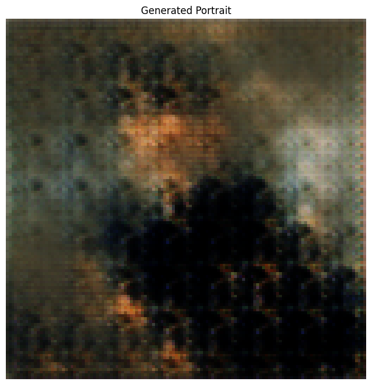

# 🎨 DCGAN Art Portrait Generator

[](https://opensource.org/licenses/MIT)
[](https://www.python.org/downloads/)
[](https://tensorflow.org/)
[](https://www.kaggle.com/datasets/karnikakapoor/art-portraits)
[]()

A Deep Convolutional Generative Adversarial Network (DCGAN) implementation for generating artistic portraits. This project uses deep learning to create unique, AI-generated portrait artworks inspired by classical paintings.



> **⚠️ Educational Note**: This implementation is primarily for educational purposes to demonstrate DCGAN concepts and architecture. The generated images may not be highly realistic due to several factors:
> - Limited training epochs for demonstration
> - Basic model architecture for clarity
> - Smaller dataset size than production systems
> 
> For production-quality results, consider:
> - Using larger architectures (StyleGAN3, SD-XL)
> - Training for 10,000+ epochs
> - Implementing progressive growing
> - Using larger datasets (100,000+ images)
> - Adding self-attention layers
> - Implementing adaptive discriminator augmentation
> - Using custom loss functions (WGAN-GP, DRAGAN)

## 📋 Table of Contents
- [Overview](#overview)
- [Features](#features)
- [Dataset](#dataset)
- [Technical Details](#technical-details)
- [Installation](#installation)
- [File Structure](#file-structure)
- [Usage](#usage)
- [Contributing](#contributing)
- [Learning Resources](#learning-resources)
- [Acknowledgments](#acknowledgments)
- [License](#license)

## 🔍 Overview

This project implements a DCGAN architecture specifically designed for generating artistic portraits. The model learns from a dataset of classical portrait paintings to generate new, unique portraits that combine various artistic styles and features. As an educational implementation, it provides a clear and documented codebase for understanding GAN architectures and training dynamics.

## ✨ Features

- **High-Resolution Output**: Generates 128x128 pixel portraits
- **Mixed Precision Training**: Utilizes TF32/FP16 for efficient training
- **Optimized Architecture**: Custom-designed for portrait generation
- **Progressive Training**: Visualizes generation progress over epochs
- **GPU Acceleration**: Fully compatible with NVIDIA GPUs
- **TFRecord Pipeline**: Efficient data loading and preprocessing
- **Label Smoothing**: Improved training stability
- **Dropout Regularization**: Better generalization
- **Educational Comments**: Detailed explanations of architecture choices
- **Training Visualization**: Loss tracking and sample generation

## 📊 Dataset

The model is trained on the [Art Portraits dataset](https://www.kaggle.com/datasets/karnikakapoor/art-portraits) from Kaggle, which contains:
- Over 4,000 portrait paintings
- Various artistic styles and periods
- High-quality images
- Diverse poses and compositions

Note: For better results, consider using larger datasets or combining multiple portrait datasets.

## 🔧 Technical Details

### Model Architecture

**Generator:**
- Input: 100-dimensional noise vector
- Progressive upsampling through 5 layers
- Transposed convolutions with batch normalization
- LeakyReLU activation functions
- Tanh output activation

**Discriminator:**
- Convolutional layers with strided convolutions
- LeakyReLU activations
- Dropout for regularization
- Binary classification output

### Training Configuration
- Batch Size: 256
- Learning Rate: 0.0002
- Beta1: 0.5
- Image Size: 128x128
- Epochs: 100
- Mixed Precision Training
- Label Smoothing: 0.9

### Areas for Improvement
- Add self-attention mechanisms
- Implement progressive growing
- Use spectral normalization
- Add custom loss functions
- Increase model capacity
- Implement gradient penalty
- Add style mixing regularization

## 📥 Installation

```bash
# Clone the repository
git clone https://github.com/yourusername/dcgan-art-portraits.git
cd dcgan-art-portraits

# Create and activate virtual environment
python -m venv venv
source venv/bin/activate  # On Windows: venv\Scripts\activate

# Install dependencies
pip install -r requirements.txt
```

## 📁 File Structure

```
📦 dcgan-art-portraits
 ┣ 📂 notebooks/
 ┃ ┗ 📜 Generating_art_using_DCGAN.ipynb
 ┣ 📜 .gitattributes
 ┣ 📜 .gitignore
 ┣ 📜 LICENSE
 ┣ 📜 README.md
 ┣ 📜 requirements.txt
 ┗ 📷 screenshot.png
```

## 🚀 Usage

1. Download the Art Portraits dataset from Kaggle
2. Open and run the Jupyter notebook:
```bash
jupyter notebook notebooks/Generating_art_using_DCGAN.ipynb
```
3. Follow the notebook instructions for:
   - Data preprocessing
   - Model training
   - Portrait generation
   
Note: The notebook includes detailed comments explaining each step and architectural choices.

## 🤝 Contributing

Contributions are welcome! Please feel free to submit a Pull Request. For major changes, please open an issue first to discuss what you would like to change.

1. Fork the repository
2. Create your feature branch (`git checkout -b feature/AmazingFeature`)
3. Commit your changes (`git commit -m 'Add some AmazingFeature'`)
4. Push to the branch (`git push origin feature/AmazingFeature`)
5. Open a Pull Request

## 📚 Learning Resources

For deeper understanding of GANs and improvements:
- [Original GAN Paper](https://arxiv.org/abs/1406.2661)
- [DCGAN Paper](https://arxiv.org/abs/1511.06434)
- [StyleGAN3 Paper](https://arxiv.org/abs/2106.12423)
- [GAN Stability Paper](https://arxiv.org/abs/1805.08318)
- [Progressive Growing of GANs](https://arxiv.org/abs/1710.10196)
- ["How to Train a GAN?" at NIPS2016](https://github.com/soumith/ganhacks)

## 🙏 Acknowledgments

- The Art Portraits Dataset by Karnika Kapoor on Kaggle
- The TensorFlow team for their excellent deep learning framework
- NVIDIA for GPU acceleration support
- The research community for GAN architecture innovations
- Various art datasets and researchers
- The open-source deep learning community

## 📄 License

This project is licensed under the MIT License - see the [LICENSE](LICENSE) file for details.

Made with ❤️ by [Pourya](https://github.com/pouryare)

[](https://github.com/pouryare)
